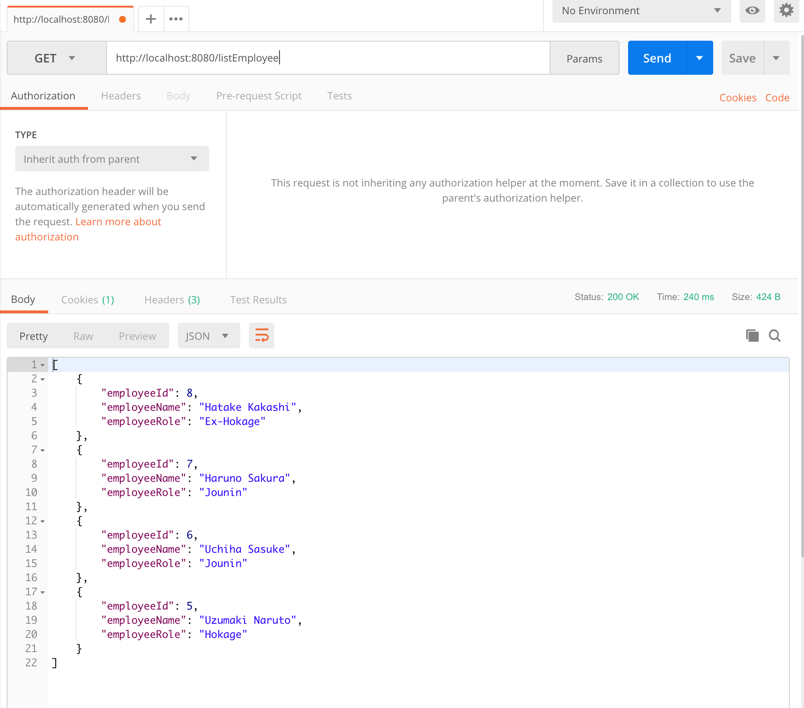
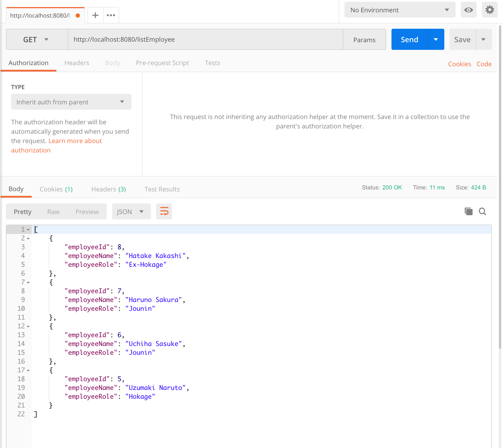

# spring-boot-database-cache-example

#### Run this project by this command :

`mvn clean spring-boot:run`

#### Demo
* While fetching the list of Employee first time it will fetch from the database but the second time it will fetch from the cache.
* While delete or add new Employee existing cache will be clear.

__List All Employee `GET localhost:8080/listEmployee`__

### Screenshot

List All Employee First time from database

List All Employee First second time from database

